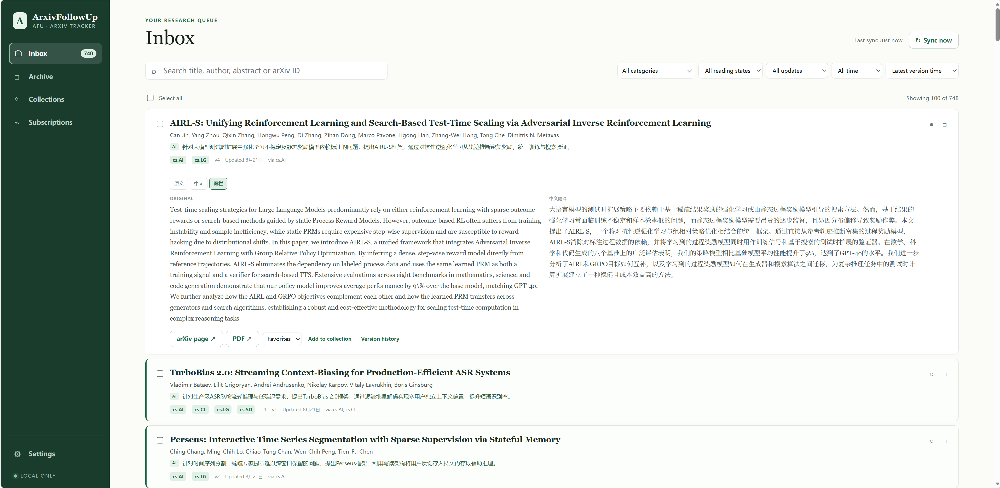

# ArxivFollowUp (AFU)

把 arXiv 新论文和版本更新送进一个本地 Inbox，并用中文解读帮助你快速判断哪些值得读。

ArxivFollowUp 是一款本地运行的 arXiv 论文追踪工具。订阅 `cs.AI`、`cs.LG` 等 Category 后，新论文会进入统一的阅读队列；已经处理过的论文如果出现更高版本，也会重新回到 Inbox，避免重要更新悄悄溜走。

连接任意 OpenAI-compatible API 后，AFU 还能为论文生成一句话中文解读和摘要翻译。订阅、论文元数据、阅读状态、收藏夹和 AI 结果均保存在本地 SQLite 中，不需要账户或云端数据库。



## 核心功能

### 持续追踪论文及版本

- 按 arXiv Category 订阅研究方向
- 增量发现新论文和更高版本，并按 arXiv ID 自动去重
- 保存本地实际观察到的版本历史
- 已归档论文出现新版本时重新进入 Inbox

### 用 AI 快速判断是否值得读

- 在论文列表中直接显示一句话中文解读
- 支持原文、中文翻译和左右双栏摘要
- 可自动处理新论文，也可只分析手动选中的论文
- 支持自定义 OpenAI-compatible API、模型和并发数

AI 完全可选。关闭后，订阅、同步和阅读管理仍可正常使用。

### 把论文当作待处理队列

- 使用 Read / Unread 标记阅读状态
- 通过 Archive 表示已经处理完成
- 使用多个 Collection 保存值得继续关注的论文
- 支持本地搜索、Category 与状态筛选，以及批量处理

### 数据留在本地

- 使用本地 SQLite 保存数据，无需登录
- 服务默认只监听 `127.0.0.1`
- 支持完整 JSON 备份与恢复
- 支持 Windows 托盘后台运行和 macOS 一键启动

## 使用方式

1. 在 **Subscriptions** 中添加想追踪的 arXiv Category。
2. AFU 同步当前 RSS，并将新论文放入 **Inbox**。
3. 浏览标题和 AI 一句话解读，展开卡片查看原文或双语摘要。
4. 将论文标为已读、加入 Collection，或在处理完成后 Archive。
5. 后续同步发现更高版本时，论文会再次出现在 Inbox 并标记为 Updated。

## 快速开始

需要 Node.js 24 或更高版本；SQLite 已由 Node.js 内置。

```bash
git clone https://github.com/Yuchen-Wang-CHN/ArxivFollowUp.git
cd ArxivFollowUp
npm ci
npm start
```

打开 <http://127.0.0.1:43110>。

### Windows

完成一次 `npm ci` 后，可以双击 `start-afu.cmd`。AFU 会在后台启动、打开默认浏览器，并常驻系统托盘。双击托盘图标可再次打开页面，通过托盘菜单中的 **Exit ArxivFollowUp** 可停止服务。

### macOS

完成一次 `npm ci` 后，可以在 Finder 中双击 `start-afu.command`。再次双击只会打开已经运行的 AFU，不会重复启动服务。双击 `stop-afu.command` 可停止后台服务。

也可以在终端中运行：

```bash
./start-afu.command
./stop-afu.command
```

启动器支持 Homebrew、Volta、asdf、nvm 和 fnm 的常见 Node.js 安装位置，也可以通过 `AFU_NODE_PATH` 指定 Node.js 可执行文件。运行日志保存在 `data/afu-macos.log`。

## AI 配置

在 **Settings → AI processing** 中填写服务地址和模型，然后选择处理模式：

- **关闭**：不创建新任务，但继续显示已有结果
- **自动**：自动分析 Inbox 中的新论文和新版本
- **手动**：只分析在 Inbox 中勾选并提交的论文

也可以在启动前通过环境变量提供默认配置：

```powershell
$env:AFU_AI_BASE_URL = 'http://127.0.0.1:8000/v1'
$env:AFU_AI_MODEL = 'Qwen/Qwen3.8-27B-FP8'
$env:AFU_AI_API_KEY = 'your-api-key'
npm start
```

| 环境变量 | 默认值 | 用途 |
| --- | --- | --- |
| `AFU_AI_BASE_URL` | `http://127.0.0.1:8000/v1` | OpenAI-compatible API 地址 |
| `AFU_AI_MODEL` | `Qwen/Qwen3.8-27B-FP8` | AI 模型名称 |
| `AFU_AI_API_KEY` | 空 | 可选 Bearer Token |

Settings 中保存的配置优先用于后续启动。

## 同步与数据

AFU 使用 arXiv RSS 发现论文，因此它从开始订阅时向后持续追踪，不会补抓 RSS 覆盖范围之外的完整历史。版本历史同样只表示 AFU 在本地实际观察到的版本。

自动同步间隔可设置为 1–7 天，并只在 AFU 运行期间执行。你也可以随时点击 **Sync now** 手动同步。

数据库和备份默认保存在：

```text
data/afu.db
data/backups/
```

可以通过以下环境变量调整本地运行位置：

| 环境变量 | 默认值 | 用途 |
| --- | --- | --- |
| `AFU_DATA_DIR` | `./data` | 数据库与备份目录 |
| `AFU_DATABASE_PATH` | `./data/afu.db` | 自定义数据库文件路径 |
| `PORT` | `43110` | 本地 HTTP 端口 |

旧版 `data/localrss.db` 会被自动识别。完整数据可以在 Settings 中导出为 JSON；恢复备份前，AFU 会先为当前数据库创建安全副本。

## 开发

运行完整检查：

```bash
npm run check
```

项目使用 GitHub Actions 在 Node.js 24 上运行相同检查。

```text
public/       浏览器界面
scripts/      Windows 托盘、macOS 启动与开发脚本
src/          HTTP 服务、数据库、同步与 AI 逻辑
test/         Node.js 测试
```

相关资料：

- [参与贡献](./CONTRIBUTING.md)
- [安全策略](./SECURITY.md)
- [Windows GitHub 与 SSH 指南](./docs/WINDOWS_GITHUB.md)

## License

[MIT](./LICENSE) © 2026 ArxivFollowUp contributors
